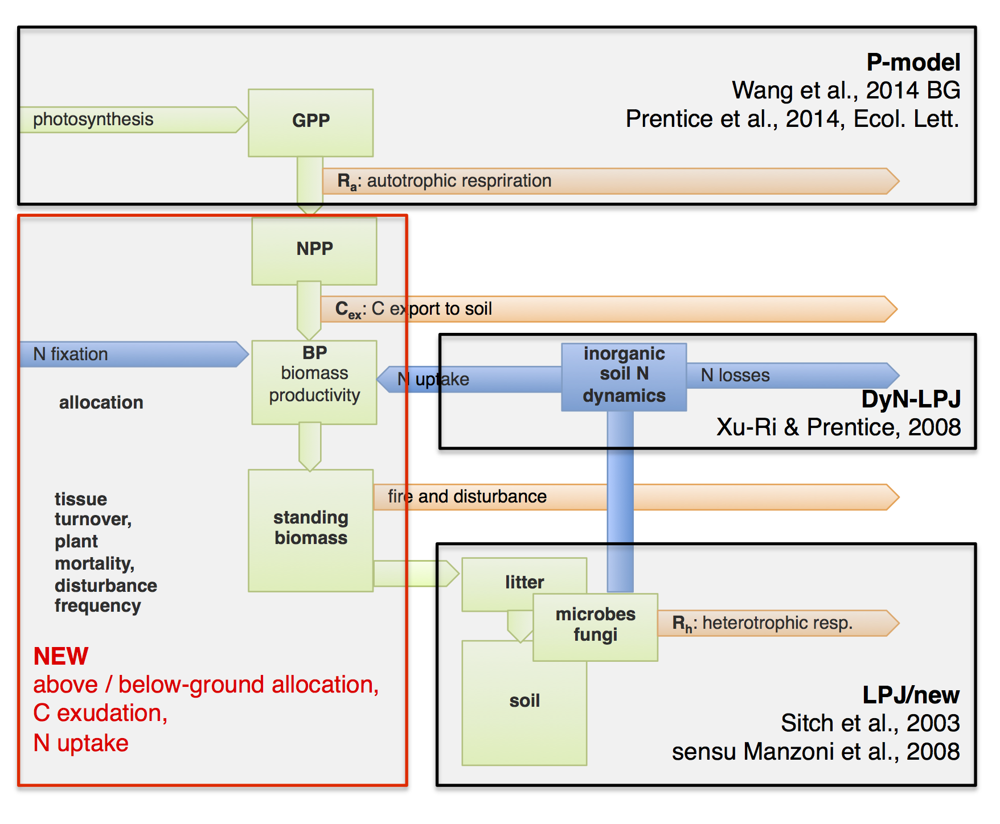

<!-- Uncomment to include FontAwesom -->
```{r setup, include=FALSE}
htmltools::tagList(rmarkdown::html_dependency_font_awesome())
```

<!-- <i class="fa fa-file fa-lg"></i> -->

<!-- To preview the correctly rendered html file, click  -->
<!-- <a href="http://htmlpreview.github.io/?https://stineb.github.io/index.html" title="preview on htmlpreview.github.io" target="_blank">here</a>.  -->


<style type="text/css">
.title {
  display: none;
}

#getting-started img {
  margin-right: 10px;
}

</style>

<div class="row" style="padding-top: 30px;">
<div class="col-sm-6">

# **SOFUN**

### *Model documentation* {style="padding-top: 0px;"}

SOFUN is a modelling framework (Stocker et al., in prep.) that combines modules for simulating light use efficiency, leaf N, growth and allocation, litter and soil decomposition, N mineralisation and inorganic soil N dynamics. SOFUN is designed in a modular fashion that allows for alternative process representations and levels of integration (see [here](https://stineb.github.io/usage.html)) to be implemented within the same modelling framework.

Its two main development directions are:

- **P-model:** Application as a light use efficiency model with presribed vegetation greenness and an optimality-based prediction of light use efficiency to simulate global GPP. This is based on Prentice et al. (2014) and Wang Han et al. (2017).
- **CN-model:** A fully integrated and coupled model for the cycling of carbon and nitrogen in terrestrial ecosystems (so far only grasslands). At the current stage, this is formulated for point-scale applications and designed to provide the basis for simulating flexible carbon allocation for a next-generation Dynamic Global Vegetation Model. The CN-model accounts for feedbacks between plants and soil processes, including N losses. It is formulated based on costs of N acquisition. Above versus belowground C allocation is determined based on a functional balance approach, whereby CO$_2$ fixation from photosynthesis (determined by leaf area) is in balance with N acquisition through roots (determined by root surface area) under the constraint of a C:N ratio required for new growth. Preliminary results are on [my website](http://bstocker.net/next-generation-global-vegetation-model/).

The model is under development and no open access for its most recent version is provided before publication. Older code is available on [github](https://github.com/stineb/sofun).

</div>
<div class="col-sm-6">


