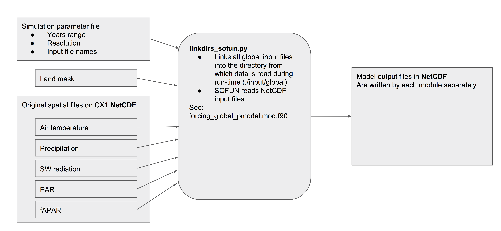

Global simulations use the same code in modules that are used by `biosphere()` but use separate modules for processing input and output, and - of course - the number of gridcells to be looped over is not one (as is the case for site-scale simulations), but around 64,000 for global simulations at a half-degree resolution. This page refers to global simulations, but of course, any subset of a collection of gridcells on a longitude-latitude grid can be simulated within one simulation. The following input data is used for global (lon/lat) simulations:

### Climate

Daily climate input is read from WATCH-WFDEI files, downloaded from `ftp://ftp.iiasa.ac.at/WFDEI/`.

Citation:
Weedon, G. P., G. Balsamo, N. Bellouin, S. Gomes, M. J. Best, and P. Viterbo (2014), The WFDEI meteorological forcing data set: WATCH Forcing Data methodology applied to ERA‐Interim reanalysis data, Water Resour. Res., 50, 7505–7514, doi:10.1002/2014WR015638.

The following variables are used in SOFUN:

- `Tair`: air temperature (2m), K, converted to degrees Celsius.
- `Rainf`: daily rainfall (liquid precipitation), kg/m2/s, converted to mm/d by multiplication by $60\cdot60\cdot24$
- `Snowf`: daily snowfall, kg/m2/s, converted to mm/d by multiplication by $60\cdot60\cdot24$
- `Qair`: specific humidity, g/g, converted to vapour pressure deficity (VPD) in units of Pa using (see `calc_vpd.R` in repository [getin](https://bitbucket.org/labprentice/getin))
- `SWdown`: shortwave downwelling radiation, W m$^{-2}$, converted to photon flux density (PPFD) in units of mol m$^{-2}$ d$^{-1}$ (see `get_pointdata_ppfd_wfdei.R` in repository [getin](https://bitbucket.org/labprentice/getin)).

### fAPAR

### Soil

### Land cover

### CO2

### Download forcing files

Global simulations (or better "lon/lat simulations") read forcing data from global NetCDF files (see figure above). All input files we use here are available on Imperial's HPC CX1 server and are stored there in a given order and naming. SOFUN may either be run on CX1, or locally. If run locally, download these files and store them, maintaining the same order of subdirectories and file names. To do so, use the bash script `download_sofun_input_netcdf.sh` from the repository [getin](https://bitbucket.org/labprentice/getin) (see also 'Usage'). Run it by entering in the terminal:
```{bash eval=FALSE}
cd your_chosen_home/getin
./download_sofun_input_netcdf.sh
```


