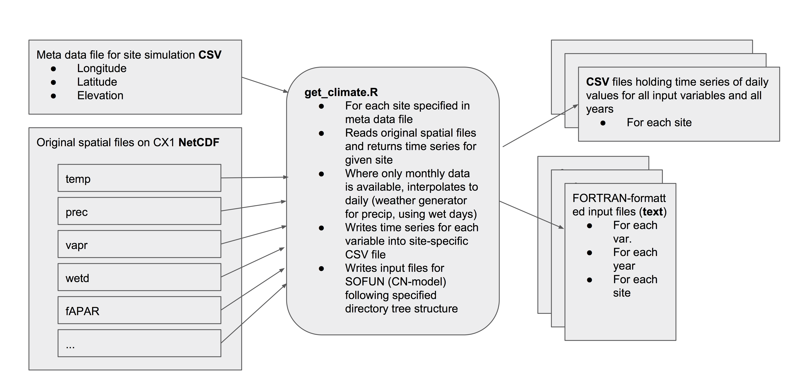

## Site scale simulations

## Setup for site-level simulations

Below, the setup - from processing input data to running simulations - for site-level simulations for all FLUXNET 2015 Tier 1 sites is given as an example.

### Summary of setup steps for site-level simulations:

  1. Get fAPAR forcing data (for P-model only)
  2. Get climate forcing data
  3. Get CO2 forcing data
  4. Get site and simulation parameter files
  5. Run SOFUN (see usage)

Model forcing data is available on Imperial HPC's CX1 (`work/bstocker/data`) or can be downloaded or read from files using R scripts in repository [getin](https://bitbucket.org/labprentice/getin). All described below.

Here, we're preparing site-specific model forcing data. Each *simulation suite* (collection of sites that belong to a certain dataset, measurement campaign, or similar), has one meta information file which specifies (at minimum) the following information:

* `mysitename`: site ID, character
* `lon`: longitude of site, decimal
* `lat`: latitude of site, decimal
* `year_start`: start year of the simulation (for which data is available)
* `year_end`: end year of the simulation (for which data is available)

For certain simulation suites, meta information files are available from the repository [getin](https://bitbucket.org/labprentice/getin): `getin/metafiles_<simsuite>/siteinfo_<simsuite>_sofun.csv`. The meta information file the "centre-piece" that is used by several scripts that loop over sites in a given simulation suite. It may also be generated by the R script in repository getin `prepare_paramfils_<simsuite>.R`, available in repository [getin](https://bitbucket.org/labprentice/getin).

Here, we're using the FLUXNET 2015 dataset. Therefore, we're setting:
```{r, eval=FALSE}
simsuite = "fluxnet2015"
```

Forcing data is written into different subdirectories of `your_chosen_home/sofun/input_<simsuite>_sofun/`. Make sure this directory exists (here for simuite=`fluxnet2015`):
```{bash, eval=FALSE}
cd your_chosen_home
mkdir -p sofun/input_fluxnet2015_sofun
```

### 1. fAPAR Get forcing data

When executing the calibration on a local machine, download the data from CX1 or process new data.

#### Downloading from CX1 
Site-scale subsets from the MODIS FPAR MCD15A3H (Collection 6) data (4 days, 500 m) for all FLUXNET 2015 Tier 1 sites are available on Imperial HPC's CX1:
`work/bstocker/data/fapar_MODIS_FPAR_MCD15A3H_fluxnet2015_gee_subset/fapar_MODIS_FPAR_MCD15A3H_<sitename>_gee_subset.csv`

Download the entire directory `fapar_MODIS_FPAR_MCD15A3H_fluxnet2015_gee_subset` and place it in `your_chosen_home/data/`. Do not modify the directory and file name structure from `your_chosen_home/data/` downwards. Specify the path in the header of file XXX.

#### Processing new 
Downloading site-scale data from Google Earth Engine and interpolating to daily data is done using `gee_subset.py` from the repository [gee_subset](https://github.com/stineb/gee_subset) by Koen Hufkens and `get_sitesubset_gee.R` from the repository [getin](https://bitbucket.org/labprentice/getin). Gapfilling and interpolation to daily values is done by filtering based on the MODIS quality flags (see `gapfill_modis.R` from the repository [getin](https://bitbucket.org/labprentice/getin)) and applying a spline to daily values.

`your_chosen_home` is the path where you chose to place the repositories getin and gee_subset and the `data` and `sofun` directories.

**1. Clone gee_subset**

In your shell, do:
```{bash, eval=FALSE}
cd your_chosen_home
git clone https://github.com/stineb/gee_subset 
```
Switch to branch `gee_stineb` by:
```{bash, eval=FALSE}
cd your_chosen_home/gee_subset
git checkout gee_stineb
```
To execute `gee_subset.py`, you must have a Google Earth Enginge login and authenticate yourself. To set this up, follow steps described in `setup_steps.md`.

**2. Clone getin**

In your shell, do:
```{bash, eval=FALSE}
cd your_chosen_home
git clone https://bitbucket.org/labprentice/getin
```
You must have a login on bitbucket and belong to the group 'labprentice' to get getin.

**3. Execute**

Change to the directory to where your local clone of the [getin](https://bitbucket.org/labprentice/getin) repository is located. In the header of the R script `get_sitesubset_gee.R` (see `MANUAL SETTINGS`), set then manual settings by hand, for example:
```{r, eval=FALSE}
##--------------------------------------------------------------------
## MANUAL SETTINGS
##--------------------------------------------------------------------
myhome               = "/alphadata01/bstocker/"
simsuite             = "fluxnet2015"
bundle               = "fapar"
overwrite_raw        = FALSE
overwrite_nice       = TRUE
do_plot_interpolated = TRUE
start_date           = "2000-01-01"
end_date             = "2017-11-27"
years_out            = 1980:2017   # creating SOFUN input data for these years
##--------------------------------------------------------------------
```

 Then execute it in R:
```{r, eval=FALSE}
setwd("your_chosen_home/getin")
source("get_sitesubset_gee.R")
```


### 2. Get climate forcing data

Climate model forcing for site-scale simulations is extracted from site-specific meteo data and/or global fields (WATCH-WFDEI and CRU TS implemented), and written to CSV files containing all days of all simulation years, as well as annual ascii text files for each year. All files are stored in a pre-defined directory structure:

* CSV files: 
  `your_chosen_home/sofun/input_<simsuite>_sofun/sitedata/climate/<sitename>/clim_daily_<sitename>.csv`
* Annual ascii text files: 
  `your_chosen_home/sofun/input_<simsuite>_sofun/sitedata/climate/<sitename>/<year>/d<var>_<sitename>_<year>.txt`

`var` stands for the variable name (`temp`, `prec`, `vpd`, `ppfd`, [`netrad`]).

All climate data for FLUXNET 2015 simulations can be read from data distributed by the FLUXNET 2015 dataset. Download the full dataset from CX1 to your local machine (alternatively, run all the following scripts on CX1). The dataset with daily data is on CX1 under:
`/work/bstocker/data/FLUXNET-2015_Tier1`. Place this directory in `your_chosen_home/data/`.

Processing new climate input files is done using functionality from the repository [getin](https://bitbucket.org/labprentice/getin). Clone this repo as described above. In `get_climate2.R`, adjust the header manually. For example:
```{r, eval=FALSE}
##--------------------------------------------------------------------
## MANUAL SETTINGS
##--------------------------------------------------------------------
myhome           = "/alphadata01/bstocker/"
simsuite         = "fluxnet2015"  
overwrite        = TRUE
overwrite_byst   = TRUE
in_ppfd          = TRUE
in_netrad        = FALSE
startyr_override = 2010
add_cru          = FALSE
add_watch        = FALSE
add_meteo        = TRUE
##--------------------------------------------------------------------
```

Then execute it in R:
```{r, eval=FALSE}
setwd("your_chosen_home/getin")
source("get_climate2.R")
```


### 3. Get CO2 forcing data

Execute the script that places a copy of the global CO2 time series in a separate directory for each site. Necessary like this - keeping it
flexible for cases where CO2 is manipulated per site/experiment. Adjust header:
```{r, eval=FALSE}
##--------------------------------------------------------------------
## MANUAL SETTINGS
##--------------------------------------------------------------------
myhome           = "/alphadata01/bstocker/"
simsuite         = "fluxnet2015"  
##--------------------------------------------------------------------
```

Then execute in R:
```{r, eval=FALSE}
setwd("your_chosen_home/getin")
source("get_co2.R")
```


