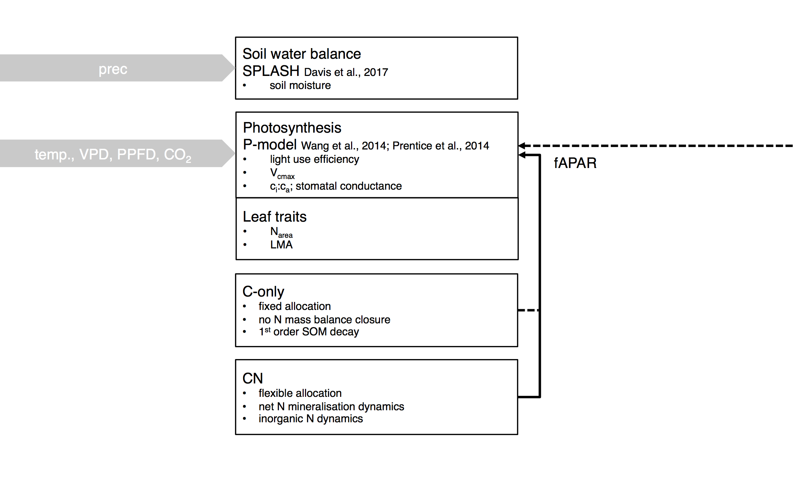

SOFUN is designed in a modular fashion that allows for alternative process representations and levels of integration (see figure below) to be implemented within the same modelling framework. Its levels of integration are described below.



*Above: Illustration of the modular hierarchy of integration. SOFUN can either be run mode **SPLASH** (simulating  evapotranspiration and the soil water balance, given precipitation), mode **P-model** (simulating ci:ca, light use efficiency and GPP, globally, given temperature, PAR, VPD, and CO$_2$), mode **C-model** (simulating the cycling of C in a grassland with fixed allocation), or mode **CN-model** (simulating the cycling of C and N in a grassland with flexible allocation). The P-model setup requires fAPAR to be prescribed, while the C-model and CN-model setups simulate LAI and fAPAR internally.*

## Levels of integration

SOFUN can be executed at different levels of integration.

### SPLASH
This setup simulates potential evapotranspiration (Priestly-Taylor equation) and the soil water balance (bucket model), given precipitation and cloud cover as inputs. The model is described in [Davis et al. (2107)](https://www.geosci-model-dev.net/10/689/2017/). The photosyntetically active radiation calculated by SPLASH may be used to drive the P-model. Soil moisture calculated by SPLASH may be used for an empirical estimate of the reduction in light use efficiency in the P-model.

Compile and execute the model by
```{bash eval=FALSE}
make splash
echo example_splash_sitescale | ./runsplash
```

An alternative implementation of the soil water balance follows the Simple Water Balance Model by [Orth et al. (2013)](http://journals.ametsoc.org/doi/abs/10.1175/JHM-D-12-099.1), where runoff is generated before 100% water holding capacity is reached. This version can be compiled and executed by
```{bash eval=FALSE}
make swbm
echo example_swbm_sitescale | ./runswbm
```


### P-model
This setup implements the P-model descrbed by [Prentice et al. (2013)](http://onlinelibrary.wiley.com/doi/10.1111/ele.12211/abstract) and [Wang Han et al. (2017)](https://www.nature.com/articles/s41477-017-0006-8?error=cookies_not_supported&code=878efd7b-d536-4a36-8b65-e24b054ba011). See also [P-model](https://stineb.github.io/pmodel.html). In combination with prescribed rates of absorbed photosynthetically active radiation, the P-model can be applied as a light use efficiency model for simulating ecosystem-level gross primary productivity.

Compile and execute for site-scale simulations by
```{bash eval=FALSE}
make pmodel
echo example_sitescale | ./runpmodel
```

Compile and execute for global simulations by
```{bash eval=FALSE}
make gpmodel
echo example_global | ./rungpmodel
```

### CN-model
This implements a fully integrated model for the cycling of carbon and nitrogen in a grassland (see [here](https://stineb.github.io/cnmodel.html)). Currently only implemented for site-scale simulations.
```{bash eval=FALSE}
make cnmodel
echo example_sitescale | ./runcnmodel
```

### C-model
This implements the same components as the CN-model, but assumes a fixed allocation (root-to-shoot ratio) and does not close the N budget. It mimics a C-only model.
```{bash eval=FALSE}
make cmodel
echo example_sitescale | ./runcmodel
```


## Run SOFUN

### Overview of steps

Steps to run SOFUN are:

  1. Get code
  2. Get forcing data (see 'Input' XXX)
  3. Get site and simulation parameter files
  4. Link files and directories
  5. Compile and run

### 1. Get code

The repository [sofun](https://bitbucket.org/labprentice/sofun) contains all the model code (Fortran 90) that implements the P-model and additional levels of model integration (water balance only, closed C, closed C and N cycles, see also [here](https://stineb.github.io)).

Clone the SOFUN repository and switch to branch pnmodel (XXX) using command line:
```{bash, eval=FALSE}
cd your_chosen_home
git clone https://bitbucket.org/labprentice/sofun
cd sofun
git checkout pnmodel
```


### 2. Get forcing data (see 'Input' XXX)
### 3. Get site and simulation parameter files

P-model simulations are done for each FLUXNET 2015 Tier 1 site separately, covering years for which data is available. After having prepared all the model forcing data by the steps described above, we now prepare the simulation and site parameter files. Here, we're conducting one simulation per site. 

Two types of paramter files have to be created:

1. **Site parameter files:** Define the geographical location, elevation and soil parameters (or soil type) for each site.
2. **Simulation parameter files:** Define the simulation start, and end years, number of spinup years, forcing data types, output variables, etc.

Both are created by `prepare_paramfils.R` available from the repository [getin](https://bitbucket.org/labprentice/getin). In the header adjust manually:
```{r, eval=FALSE}
##--------------------------------------------------------------------
## MANUAL SETTINGS
##--------------------------------------------------------------------
myhome           = "/alphadata01/bstocker/"
simsuite         = "fluxnet2015"  
overwrite        = TRUE
##--------------------------------------------------------------------
## uncomment:
systr <- "''"    # for Mac
##--------------------------------------------------------------------
```

Then run in R:
```{r, eval=FALSE}
setwd("your_chosen_home/getin")
source("prepare_paramfils.R")
```

### 5. Get, compile and run SOFUN

The repository [sofun](https://bitbucket.org/labprentice/sofun) contains all the model code (Fortran 90) that implements the P-model and additional levels of model integration (water balance only, closed C, closed C and N cycles, see also [here](https://stineb.github.io)). Typically, a certain tag from a certain branch is desired. Let's say you wish to checkout version 1.1.0, corresponding to the git tag `v1.1.0` from the git branch `pnmodel`. For this, do the following in your shell:

```{bash, eval=FALSE}
cd your_chosen_home
git clone https://github.com/stineb/sofun.git
git remote set-url origin https://github.com/stineb/sofun.git
git fetch origin
git checkout tags/v1\.1\.0 -b pnmodel
```

You may avoid the backslashes above (`\`) - I had to write it, otherwise a bug prevented this code snippet to be displayed.

Then, create soft links to input and parameter file directories by executing the Python script `linkdirs_sofun.py`. Before executing, specify the simulation suite inside this script manually:
```{py, eval=FALSE}
simsuite = 'fluxnet2015'
```

The following specification is required only for global simulations to link input fields (climate, fAPAR) to locations where data is read by SOFUN:
```{py, eval=FALSE}
dataroot = 'your_chosen_home/data/'
```

Then
```{bash, eval=FALSE}
python linkdirs_sofun.py
```

### 5. Compile and run

Running the set of simulations for the suite `fluxnet2015` is done be simply executing the Python script (after setting manually: `simsuite = 'fluxnet2015'`):
```{bash, eval=FALSE}
python submitjobs_sofun.py
```

This executes the following basic statements that compile and run SOFUN:
```{bash, eval=FALSE}
make pmodel
echo simulation_name | ./runpmodel
```
This setup compiles with the open-access GNU compiler for Fortran 90 gfortran and with the (non-open access) Portland Group Fortran Compiler.
